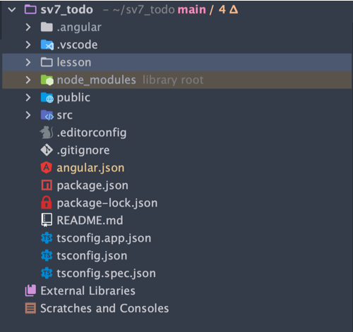

###Directory structure

# Angular 19 Project Folder Structure (`sv7_todo`)

This document describes the folder and file structure of an Angular 19 project based on the provided image.

---

## 📁 Root Folder: `sv7_todo`

This is the root directory of the Angular 19 project. It contains configuration files, dependencies, and the main source code.

---

## Folders

### `.angular/`
- Internal Angular CLI cache and configuration.
- Used for faster builds and storing local settings.
- Typically not manually edited.

### `.vscode/`
- Editor-specific folder for Visual Studio Code.
- Contains settings for formatting, debugging, and extensions.

### `node_modules/`
- Automatically generated by `npm install`.
- Contains all dependencies used in the project.
- Should not be manually modified.

### `public/`
- May be used to store static assets manually added by the developer.

### `src/`
- Main source code folder.
- Contains components, services, modules, styles, and application logic.

---

### `.editorconfig`
- Maintains consistent coding styles between different editors and IDEs.

### `.gitignore`
- Specifies intentionally untracked files to ignore in version control (e.g., `node_modules`, `dist/`).

### `angular.json`
- Angular CLI configuration.
- Manages project structure, build settings, and workspace metadata.

### `package.json`
- Manages project dependencies, scripts, and metadata.
- Core configuration for NPM.

### `package-lock.json`
- Auto-generated file that locks dependency versions.
- Ensures consistent installations across environments.

### `README.md`
- Markdown file containing documentation, setup instructions, and usage guidelines.

---

## TypeScript Configuration

### `tsconfig.json`
- Base TypeScript configuration shared across the project.

### `tsconfig.app.json`
- Specific TypeScript config for the application (excluding tests).

### `tsconfig.spec.json`
- TypeScript config for unit tests (Karma/Jasmine).

---

## Summary (Angular 19 Context)

- The structure remains consistent with earlier Angular versions.
- Angular 19 may include advanced features like:
  - Signals
  - Improved SSR/hydration
  - Enhanced standalone component support

> ✅ The project follows best practices for scalability and modularity.

